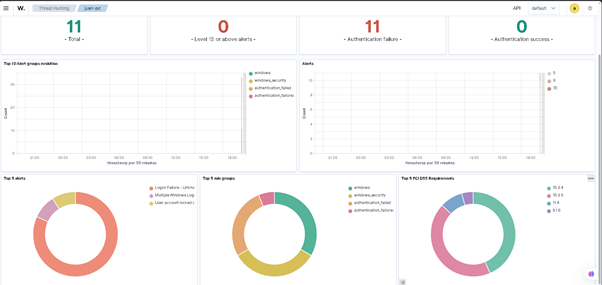

# IR-001 — Administrator Account Lockout via Brute Force

**Date:** 2026-04-17  
**Analyst:** Juan Alexander Alejo  
**Severity:** Medium  
**Status:** Resolved  
**Agent:** juan-pc  

---

## Summary

Wazuh SIEM detected 11 authentication failure events on endpoint `juan-pc` 
within a 2-minute window, resulting in automatic Administrator account 
lockout. Event pattern was consistent with a brute force login attack.

---

## Timeline

| Time | Event |
|------|-------|
| 18:00 | First failed logon attempt — Event ID 4625 |
| 18:01 | Repeated failures trigger rule: Multiple Windows Logon Failures |
| 18:01 | Administrator account locked out — Event ID 4740 |

---

## Alerts Triggered

| Rule | Group | Severity |
|------|-------|----------|
| Logon Failure — Unknown user | authentication_failed | Medium |
| Multiple Windows Logon Failures | authentication_failures | Medium |
| User account locked out | windows_security | Medium |

---

## SIEM Data

- **Total alerts:** 11  
- **Authentication failures:** 11  
- **Authentication successes:** 0  
- **Level 12+ alerts:** 0  

---

## PCI-DSS Compliance Mapping

| Requirement | Description |
|-------------|-------------|
| 10.2.4 | Invalid logical access attempts |
| 10.2.5 | Use of identification and authentication mechanisms |
| 8.1.6 | Account lockout after repeated failed attempts |
| 11.4 | Intrusion detection and prevention |

---

## Root Cause

Simulated brute force attack against local Administrator account using 
repeated failed credential attempts via PowerShell. Windows account lockout 
policy triggered after threshold was reached.

---

## Impact

- Administrator account temporarily locked
- No successful authentication recorded
- No lateral movement or data access occurred

---

## Containment & Resolution

- Account lockout policy automatically contained the attack
- Administrator account manually unlocked after investigation
- Lockout threshold reset to unlimited for lab environment

---

## Recommendations

1. Set account lockout threshold to 5 attempts in production environments
2. Enable alerting for lockouts across all privileged accounts
3. Implement MFA on all Administrator accounts
4. Monitor for distributed brute force across multiple accounts

---

## Evidence

